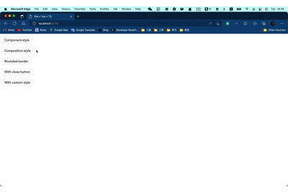

# Vue3 Simple Confirm

*_**Read this in other languages:**_*

[_English_](README.md)

简易的 Vue3 消息确认框，用于构建简单的Web页面

## 

## 功能

- 组件式调用
- API式调用
- 完整的Typescript提示
- 基于Promise，支持异步

## 文件

| File                        | Size                      |
| --------------------------- | ------------------------- |
| style.css                   | 0.76 KiB / gzip: 0.38 KiB |
| simple-confirm-vue3.umd.cjs | 1.76 KiB / gzip: 0.81 KiB |
| simple-confirm-vue3.js      | 1.78 KiB / gzip: 0.72 KiB |

## 安装

```bash
npm i simple-confirm-vue3
```

or

```bash
yarn add simple-confirm-vue3
```

在main.ts中引入css文件

```typescript
import "simple-confirm-vue3/lib/style.css";
```

## 使用

### 组件式调用

#### 全局引入 (全局引入时，组件名固定为***vue-confirm***)

```typescript
import { createApp } from "vue";
import "simple-confirm-vue3/lib/style.css";
import SimpleConfirm from "simple-confirm-vue3";

createApp(App).use(SimpleConfirm).mount("#app");
```

##### 在组件中使用

```vue
<script setup>
import { ref } from "vue";
const showDialog = ref(false);
</script>

<template>
  <vue-confirm
    title="Component Style"
    content="A ham sandwich walks into a bar and orders a beer, bartender says
          “sorry, we don’t serve food here.”"
    v-model="showDialog"
    :rounded="true"
    confirmText="Okay"
    cancelText="Nope"
  >
  </vue-confirm>
</template>
```

#### 在单文件中引入使用

```vue
<script setup>
import { Confirm as myConfirm } from "simple-confirm-vue3";
import { ref } from "vue";

const showDialog = ref(false);
</script>

<template>
  <my-confirm
    title="Component Style"
    content="A ham sandwich walks into a bar and orders a beer, bartender says
          “sorry, we don’t serve food here.”"
    v-model="showDialog"
    :rounded="true"
    confirmText="Okay"
    cancelText="Nope"
  ></my-confirm>
</template>
```

### API调用

```typescript
import { useConfirm } from "simple-confirm-vue3";

useConfirm({
  /* options */
})
  .then(() => {
    // do something when user confirmed
  })
  .catch(() => {
    // do something when user canceled
  });
```

## 属性

|    Name     |   Type   |                         Description                         |
| :---------: | :------: | :---------------------------------------------------------: |
|    title    | string?  |                              -                              |
|   content   |  string  |                              -                              |
| modelValue  | boolean  |                  用于组件式调用v-model绑定                  |
|   rounded   | boolean? |                          是否圆角                           |
|    cross    | boolean? |                   是否展示右上角关闭按钮                    |
| cancelText  | string?  |                        取消按钮文字                         |
| confirmText | string?  |                        确认按钮文字                         |
| customClass | string?  | 自定义类名**（_自定义类不能标注scoped,否则获取不到样式_）** |

